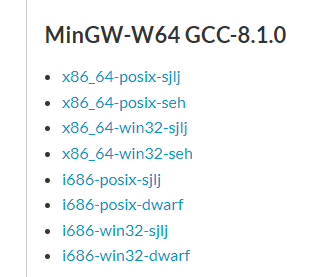

2023-10-31               总计数：0001
#### 在VSCode上增加Markdown文件的处理；
插件：
1、Markdown Preview Enhanced；
2、Markdown All in One；
3、Paste Image；
4、Markdown PDF；


#### Markdown的通用标注(CommonMark)

1、粗体
粗体**粗体**粗体

2、斜体
斜体*斜体*斜体

3、加粗斜体
加粗斜体***加粗斜体***加粗斜体

4、删除
删除~~删除~~删除

5、链接
链接：[链接说明](链接)

6、代码引用，预览支持语法高亮显示，形式如下
``` C
C语言源代码
```

7、引用
>引用


#### MinGW-w64的安装及配置教程
MinGWQ的全称是：Minimalist GNU on Windows。它实际上是将经典的开源C语言编译器GCC移桔到了Windows平台下，并且包含了Win32API,因此可以将源代码编译为可在Windows中运行的可执行程序。而且还可以使用一些Windows不具备的，Linux平台下的开发工具。一句话来概括：MinGW就是GCC的Windows版本。
MinGW-w64与MinGW的区别在于MinGW只能编译生成32位可执行程序，而MinGW-w64则可以编译生成64位或32位可执行程序。正因为如此，MinGW现已被MinGW-w64所取代，且MinGW也早已停止了更新，内置的GCC停滞在了4.8.1版本，而MinGW-w64内置的GCC则更新到了8.1.0版本。(2020/12/15)

##### 1.下载MinGW-w64
我这里MinGW-w64文件，想省略第一步的可以直接下载：
https://download.csdn.net/download/didi ya/13697507
官网下载步骤：
官方地址：http://mingw-w64.org/doku.php

找到上图的下载器，打开后选择要下载的版本和适用环境；
1、Version，指的是gcc的版本，如果没有特殊的需求，一般选择最高的版本号即可。
2、选择电脑系统架构，电脑系统是64位的，选择x86_64;如果是32位系统，则选择i686即可。
3、选择操作系统接口协议，如果你想要开发Windows程序，需要选择win32,而开发Linux、Unix、Mac OS等其他操作系统下的程序，则需要选择posix;
4、选择异常处理模型(64位)，异常处理在开发中非常重要，在开发的过程中，大部分的时间会耗在处理各种异常情况上。seh是新发明的，而sjlj则是古老的。
seh性能比较好，但不支持32位。sjlj稳定性好，支持32位。建议64位操作系统选择seh。
5、之后更改路径，一路Next即可；
说明：
因为网络等问题，下载器有很大可能下载不成功。直接进入下载界面：
https://sourceforge.net/projects/mingw-w64/files/
里面有针对各个选项下的文件，可以直接下载。

下载后解压缩，将BIN所在的目录复制到环境变量的path中。
使用命令行输入**gcc -v**验证安装并目配置环境变量是否成功：


